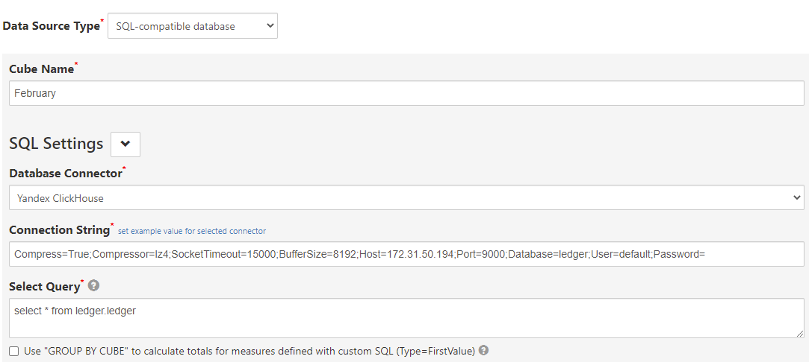

# clickhouse_utils
A collection of Clickhouse-related utilities

To spin up a docker-compose cluster with Kafka and Clickhouse, run `docker-compose up -d` in this directory. 
Warning: the ports it exposes won't be visible outside of the machine it runs on unless you port map with ssh or similar.

For an example of data ingestion from Kafka, see `src/notebooks/kafka_import.ipynb`

To bring up a standalone Clickhouse instance visible outside of the machine it runs on, run 
`docker run -d --network=host --name clickhouse-server --ulimit nofile=262144:262144 --volume=storage_standalone:/var/lib/clickhouse yandex/clickhouse-server`
**This will only work on Linux, not Mac or Windows!**

## Ingesting the json files
To initialize the table schema to ingest into, run `initialize.py` (after editing to suit).
**WARNING: THIS WILL DELETE THE TABLE IF IT ALREADY EXISTED**

To bulk-ingest json files produced by the json dumper in `load_main.py` from the `treasury_accounting` repo (meant for Druid ingestion), run
` ls ./ledger_2021-02-01* | while read p; do cat $p | clickhouse-client --database=ledger --input_format_skip_unknown_fields=1 --query="INSERT INTO ledger FORMAT JSONEachRow"; done`
from the command line in the directory where those files live (assuming the server runs on the same machine).
## Starting SeekTable
On your local machine, change into the `seektable` directory and run `docker-compose up`. 

Then in a browser, go to `localhost:80` and you will see the SeekTable interface. Setup an account (as far as I understand,
all that data will remain local to your machine), and setup the connection like so:

And then add all the measures/dimensions you'll want, below in the same screen.

[Here](https://www.seektable.com/help/create-pivot-table) is a basic intro to how to use SeekTable.